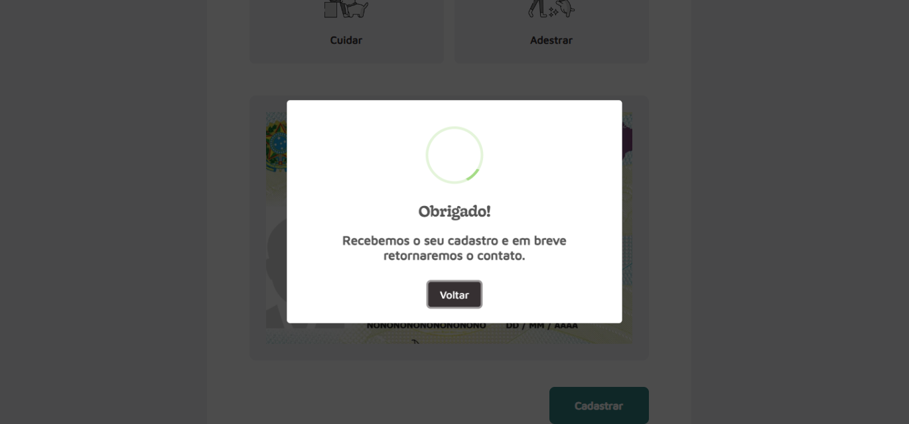
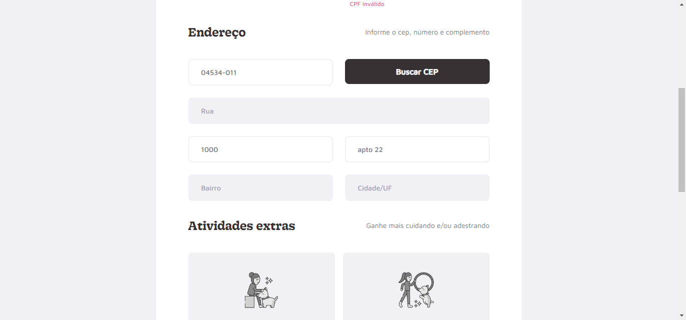
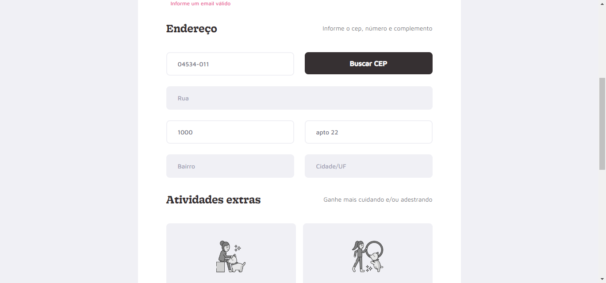
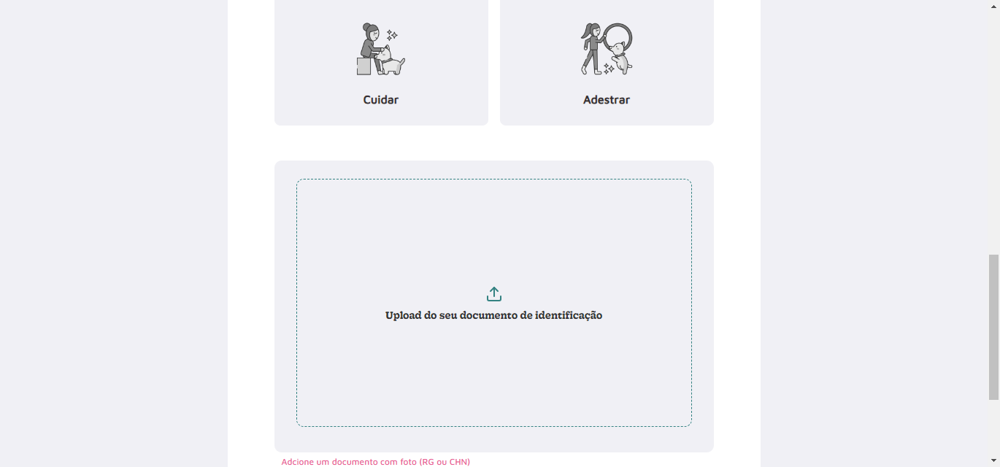
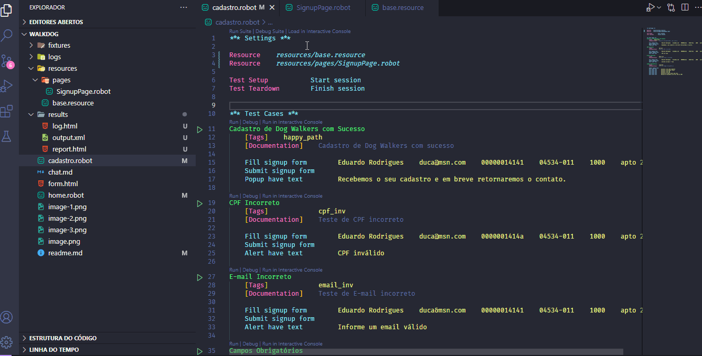

# AutomatizAi-Robot-Walkdog

Este foi um projeto desenvolvido para automatização de testes, utilizando o ChatGPT para auxílio na escrita de cenários baseados em Gherkin, e Robot Framework para execução dos testes automatizados.

## Evidência dos testes:

Cadastro com sucesso:

CPF inválido:

E-mail inválido:

Campos obrigatórios:

## Confira abaixo o gif do teste por completo:
